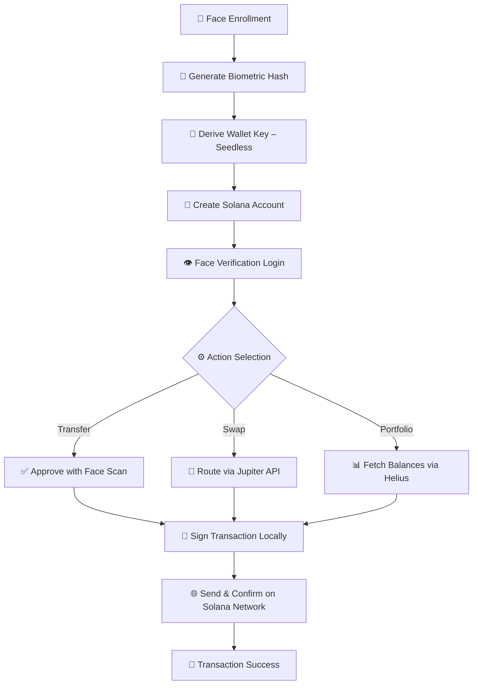
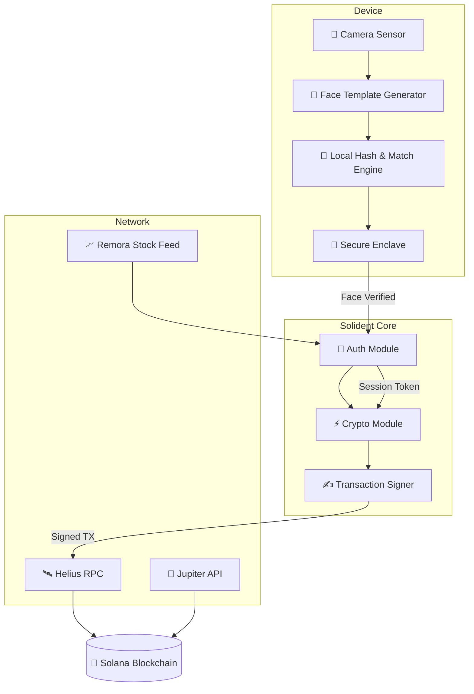

# 🧬 Solident Foundation  
**Biometric-first wallet and identity layer on Solana.**  
Secure, seedless, and built for the next generation of DeFi.  

---

## 🔐 Core Principles  
- Face-based wallet creation (no seed phrase)  
- Biometric-only transaction approval  
- Zero-trust architecture  
- Cross-device continuity  

---

## 🧠 Projects  
| Project | Description |
|----------|--------------|
| [solident-dapp](https://github.com/solidentxyz/solident-dapp) | Main biometric wallet interface |
| [solident-core](https://github.com/solidentxyz/solident-core) | Core libraries & SDK |
| [solident-docs](https://solident.gitbook.io) | Technical and user documentation |

---

## ⚙️ Workflow Diagram  

---
## 🛡️ Security Architecture  

---

## Official Channels  

**Website:** [solident.xyz](https://solident.xyz)  
**Docs:** [solident.gitbook.io](https://solident.gitbook.io)  
**X (Twitter):** [@solidentxyz](https://x.com/solidentxyz)  
**Telegram:** [t.me/solidentxyz](https://t.me/solidentxyz)  

---

> Solident is building the next generation of seedless, biometric DeFi on Solana.  
> Secure by design. Face-verified. Zero trust. Limitless access.  

---

© 2025 **Solident Foundation** — Built on Solana
