# 🧬 Solident Foundation  
**Biometric-first wallet and identity layer on Solana.**  
Secure, seedless, and built for the next generation of DeFi.  

---

## 🔐 Core Principles  
- Face-based wallet creation (no seed phrase)  
- Biometric-only transaction approval  
- Zero-trust architecture  
- Cross-device continuity  

---

## 🧠 Projects  
| Project | Description |
|----------|--------------|
| [solident-dapp](https://github.com/solidentxyz/solident-dapp) | Main biometric wallet interface |
| [solident-core](https://github.com/solidentxyz/solident-core) | Core libraries & SDK |
| [solident-docs](https://solident.gitbook.io) | Technical and user documentation |

---

## ⚙️ Workflow Diagram  

```mermaid
flowchart TD
    A[📸 Face Enrollment] --> B[🧠 Generate Biometric Hash]
    B --> C[🔑 Derive Wallet Key – Seedless]
    C --> D[💼 Create Solana Account]
    D --> E[👁️ Face Verification Login]
    E --> F{⚙️ Action Selection}
    F -->|Transfer| G[✅ Approve with Face Scan]
    F -->|Swap| H[🔄 Route via Jupiter API]
    F -->|Portfolio| I[📊 Fetch Balances via Helius]
    G & H & I --> J[🔏 Sign Transaction Locally]
    J --> K[🌐 Send & Confirm on Solana Network]
    K --> L[🎉 Transaction Success]
```

---
## 🛡️ Security Architecture  

```mermaid
flowchart TD
    subgraph Device
    A1[📱 Camera Sensor] --> A2[🧩 Face Template Generator]
    A2 --> A3[🧠 Local Hash & Match Engine]
    A3 --> A4[🔐 Secure Enclave]
    end

    subgraph Solident Core
    B1[🧭 Auth Module] --> B2[⚡ Crypto Module]
    B2 --> B3[✍️ Transaction Signer]
    end

    subgraph Network
    C1[🛰️ Helius RPC]
    C2[🔁 Jupiter API]
    C3[📈 Remora Stock Feed]
    end

    A4 -->|Face Verified| B1
    B1 -->|Session Token| B2
    B3 -->|Signed TX| C1
    C1 --> D1[(💎 Solana Blockchain)]
    C2 --> D1
    C3 --> B1
```

---

## 🌐 Links  
- Website → [solident.xyz](https://solident.xyz)  
- Docs → [solident.gitbook.io](https://solident.gitbook.io)  
- X → [@solidentxyz](https://x.com/solidentxyz)  
- Telegram → [t.me/solidentxyz](https://t.me/solidentxyz)

---

> Powered by Solana. Designed for a future without seed phrases.

<!--
**solidentxyz/solidentxyz** is a ✨ _special_ ✨ repository because its `README.md` (this file) appears on your GitHub profile.

Here are some ideas to get you started:

- 🔭 I’m currently working on ...
- 🌱 I’m currently learning ...
- 👯 I’m looking to collaborate on ...
- 🤔 I’m looking for help with ...
- 💬 Ask me about ...
- 📫 How to reach me: ...
- 😄 Pronouns: ...
- ⚡ Fun fact: ...
-->
